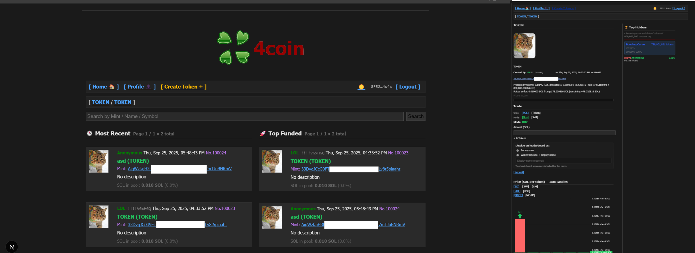
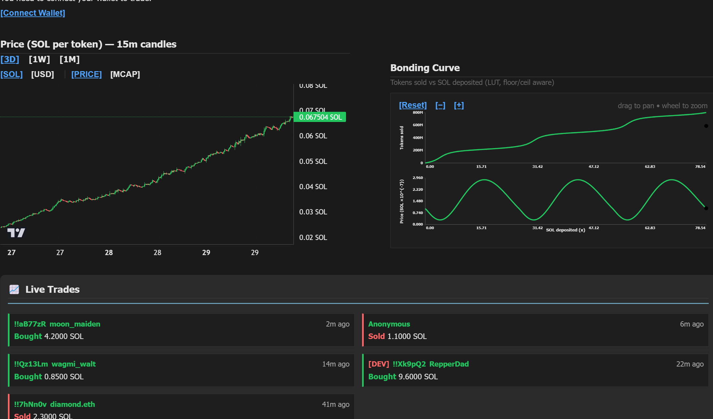
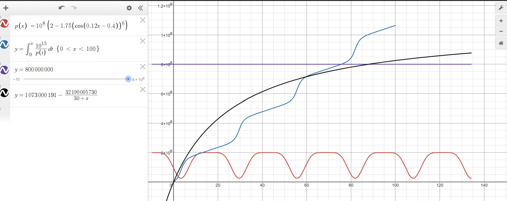

# 4coin

A pump.fun-style token launcher on Solana: an Anchor bonding-curve program, a Node/Express backend that indexes chain state into Postgres, and a Next.js frontend for creating, trading, and charting tokens.




## Structure

- **`bonding_curve/`** — Anchor program (Rust) implementing the bonding curve.
- **`backend/`** — Express API (ESM, Node) that talks to the Solana RPC and a Postgres database.
- **`frontend/`** — Next.js app (App Router) with wallet-adapter integration, a lightweight-charts price chart, live trade feed, comments, and leaderboard pages.

### On-chain program (`bonding_curve/programs/bonding_curve/src`)

Program id: `EcmMaHYxoz3VhNg8M8TBFVAc7Xy4VHW6nBBWhPyE8HrP`. Instructions, one file each under `instructions/`:

- `initialize` — sets up the global curve configuration (protocol fee).
- `create_pool` — creates a new bonding-curve pool for a mint, recording a `migration_authority`.
- `buy` / `sell` — trade against the curve. `buy` takes an `eph_pub` / `announcement_ct` / `nonce` in addition to `amount`, suggesting an encrypted/announcement scheme layered on top of the trade (see `instructions/buy.rs`).
- `add_liquidity` / `remove_liquidity` — LP management on the curve's reserves.
- `start_migration` / `finalize_migration` — once a curve is "graduated" (cap reached), migrates its reserves into a Raydium CPMM pool (devnet CPMM program `DRaycpLY18LhpbydsBWbVJtxpNv9oXPgjRSfpF2bWpYb`).

Emits `CapReached`, `MigrationStarted`, and `MigrationFinalized` events that the backend listens/polls for. Curve maths lives in `utils/curve.rs` / `utils/calc.rs`, with a precomputed `curve_lut_data.rs` lookup table.

### Backend (`backend/`)

Express app (`server.js`) wiring together route modules and a 10s polling loop that resyncs on-chain mints, auto-migrates graduated curves, and refreshes the SOL/USD quote.

| Route file | Endpoints |
|---|---|
| `trading.js` | `POST /buy`, `POST /sell`, `POST /update-holdings`, `GET /trades` |
| `tokens.js` | `POST /prepare-mint-and-pool`, `POST /save-token`, `GET /tokens`, `GET /tokens-by-creator`, `GET /token-info` |
| `migration.js` | `POST /migrate/one`, `POST /migrate/scan`, `GET /pool-info` |
| `comments.js` | `GET/POST /comments` |
| `leaderboard.js` | `GET /leaderboard` |
| `wallet.js` | `GET /wallet-stats`, `GET /wallet-timeseries` |
| `uploads.js` | `POST /upload` (token icon, via multer) |
| `misc.js` | `GET /tripcode`, `GET /leaderboard-pref`, `GET /price-history`, `GET /sol-usd` |

Also exposes `GET /stream/holdings`, a Server-Sent-Events stream (`lib/sse.js`) that broadcasts live trades/holdings to connected clients.

`instructions/` mirrors the on-chain instruction set in JS (`buy.js`, `sell.js`, `initCurve.js`, `migrate.js`, `prepareMintAndPool.js`, `derive.js`) for building and sending transactions from the API — `migrate.js` in particular drives the CPMM migration against the Raydium SDK. `lib/chain.js` handles resyncing mint/pool state from the chain; `lib/db.js` is the Postgres layer; `lib/quotes.js` fetches the SOL/USD price; `lib/files.js` manages holdings/metadata persistence; `lib/verifyTurnstile.js` verifies Cloudflare Turnstile captcha tokens.

### Frontend (`frontend/`)

Next.js App Router pages:

- `home/` — token discovery/listing feed.
- `token/` — individual token page (largest file, ~1800 lines): trading UI, price chart, live trades, comments.
- `form/` — token creation form.
- `profile/` — user/wallet profile page.
- `demo/` — a demo/sandbox page.

Key components under `components/`: `BondingCurve.js` (buy/sell UI + curve maths), `PriceChart.js` (lightweight-charts candles), `LiveTrades.js` (SSE-driven trade feed), `Comments.js`, `Leaderboard.js`, `Header.js`, `SiteBanner.js`. `lib/error.js` centralizes user-facing error handling/formatting. Wallet connectivity uses `@solana/wallet-adapter-react` (Backpack + standard wallet adapters).

## Running locally

**Backend**
```
cd backend
npm install
node server.js       # listens on PORT env var, default 4000
```
Requires a `.env` with Postgres connection info, Solana RPC URL, and program keypairs (see `backend/config/`, `backend/keys/`).

**Frontend**
```
cd frontend
npm install
npm run dev           # Next.js dev server with Turbopack
```
Requires `frontend/.env.local` pointing at the backend API and Solana RPC/cluster.

**On-chain program**
```
cd bonding_curve/bonding_curve
anchor build
anchor test
```

## Bonding curve: maths and motivation



pump.fun's original curve is a constant-product hyperbola: cumulative tokens sold as a function of SOL raised is

```
tokens_sold(x) = V_t − k / (V_s + x)
```

with virtual token reserves `V_t`, virtual SOL reserves `V_s`, and `k = V_t·V_s` fixed at pool creation. Price is smooth and monotonically increasing over the whole raise — the black curve in the plot above (`V_s = 30`, `V_t ≈ 1,073,000,191`). It's simple, but it means the price only ever goes one direction: up, at a decelerating rate.

This project's curve is deliberately not that. Instead of a single smooth price function, it repeats a fitted "cycle" shape three times over the raise, so buyer cost oscillates through repeated cheap/expensive phases rather than climbing monotonically — closer to how a real speculative market chops between accumulation and markup than a pure hyperbola. The rest of this section is how that's actually built and made safe to run on-chain.

### 1. Price function `k(x)`

`k(x)` is SOL cost per marginal token at position `x` SOL raised. It's defined on one period `[0, T]` as a degree-10 polynomial (`frontend/scripts/lut.js`, coefficients `P`), fitted to a target shape resembling `10^8·(2 − 1.75·cos(0.12x − 0.4))^6` — a smooth curve with repeated humps rather than a single peak (that cosine form is what's plotted as the red curve above; the shipped `k(x)` is a polynomial fit of the same idea, not the literal cosine, because a polynomial is cheap to evaluate repeatedly in the LUT builder below).

The full domain repeats that one period three times by simple shift, with no rescaling between repeats:

```
T     = 26.1799387799149450017921481048688292503357   (one cycle, SOL)
X_MAX = 3T ≈ 78.5398                                    (full raise, SOL)

k(x) = k1(x)        for x in [0, T]
     = k1(x − T)     for x in [T, 2T]
     = k1(x − 2T)    for x in [2T, 3T]
```

### 2. Cumulative supply `F(x)`

Tokens minted per unit SOL at position `x` is `1/k(x)`, so cumulative tokens sold is the integral

```
F(x) = ∫₀ˣ 1/k(t) dt
```

— the blue step-and-plateau curve above: it rushes upward while `k(x)` is in a cheap trough and flattens while `k(x)` is near a peak, three times over.

`1/k(x)` has no closed-form antiderivative, so `lut.js` integrates it numerically, one small bin at a time (`simpsonInvK_local`), using **composite Simpson's rule**: each bin `[a, b]` is split into `m=2` sub-intervals (3 sample points — both endpoints plus the midpoint), and the integral over that bin is approximated by fitting a parabola through those 3 points rather than a straight line, which is exact for cubics and very accurate for a smooth polynomial like `k(x)`:

```
∫ₐᵇ f(x) dx ≈ (h/3)·[f(a) + 4·f(m) + f(b)],   h = (b − a)/2,  m = (a+b)/2
```

Running this bin-by-bin and accumulating the results (`F_int[i+1] = F_int[i] + increment`) builds the full cumulative curve `F(x)` across all 4096 nodes. The whole array is then rescaled by a single calibration constant `β = CAP_TOKENS / F(X_MAX)` so the curve lands exactly on the supply cap:

```
CAP_TOKENS = 800,000,000        (purple line above)
F_calibrated(x) = β · F(x),   F_calibrated(X_MAX) = CAP_TOKENS
```

### 3. Why a lookup table instead of evaluating `k(x)` on-chain

Evaluating a degree-10 polynomial and numerically integrating it inside a Solana program is expensive and — worse — `f64` arithmetic isn't guaranteed bit-identical across compilation targets, which is a correctness hazard for anything handling money. So the curve is precomputed once, off-chain, into a monotone cumulative table and shipped as static data:

- `frontend/scripts/lut.js` builds `F_calibrated(x)` at 4096 nodes, converts each node to both a **floor** and a **ceil** rounding into base token units (`y_floor[i]`, `y_ceil[i]`), and writes `lut.dec9.json`.
- That table is baked into the program as `curve_lut_data.rs` (`Y_FLOOR` / `Y_CEIL` arrays), consumed by `utils/curve.rs`.

Carrying both a floor and a ceil table (rather than one rounded array) matters: interpolating and rounding in only one direction lets a user round-trip a buy-then-sell (or vice versa) and extract a few base units of a token for free, repeatedly. Using floor for one side of a trade and ceil for the other guarantees the program is always conservative — it never gives out more than the true curve owes and never charges less than the true curve requires — at the cost of a few base units of dust siding with the protocol instead of the user.

### 4. Trading against the table (`utils/curve.rs`)

- **Position lookup**, `x_from_y_lut`: given cumulative tokens sold so far, binary-search the `Y_FLOOR` table for the largest node `≤ y`, then linearly interpolate the fractional SOL position `x` within that segment.
- **Buy**, `buy_on_curve`: convert the lamport budget to a SOL delta, advance `x0 → x1`, and hand out `F_floor(x1) − F_ceil(x0)` tokens (both bounds conservative, clamped to whatever's left under the cap).
- **Sell**, `sell_on_curve`: binary-search for the `x1 ≤ x0` such that `F_ceil(x0) − F_floor(x1)` covers the tokens being sold, then pay out `x0 − x1` SOL, floored.

Both directions clamp to `[0, X_MAX]` and to the 800M cap, so the curve can't be pushed out of its calibrated domain in either direction.

## Notes

- The backend expects Postgres (`pg` dependency) — schema/migrations live alongside `backend/lib/db.js`.
- Trading against Raydium migration targets the devnet CPMM program id; check `backend/instructions/migrate.js` before pointing this at mainnet.
- The `buy` instruction's `eph_pub`/`announcement_ct`/`nonce` params imply an encrypted trade-announcement scheme on top of the base bonding-curve buy — see `bonding_curve/.../instructions/buy.rs` for the exact handling.
